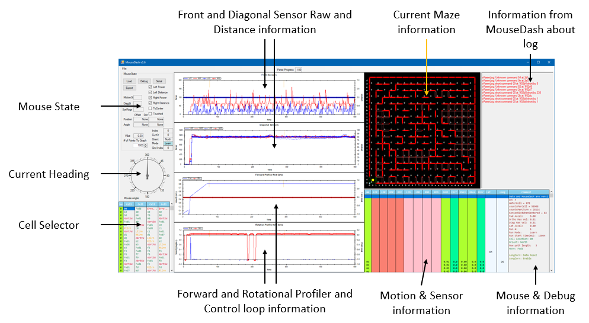

# MouseDash
MouseDash is a Windows C# application that is used to analyze data from a micromouse robot. A micromouse is an autonomous robot that has to navigate itself from the corner of a maze to the center. 

Check out the following links for more information on Micromouse:

[Micromouse Online](http://www.micromouseonline.com)

[Wikipedia: MicroMouse](https://en.wikipedia.org/wiki/Micromouse)

# Overview
There are two main components to logging - code that runs on the mouse to record the data we want to log and an application that runs on the PC to display the logged data. Prior to creating and using MouseDash, many times, I've seen the mouse do something and not been able to figure out why it happened. With MouseDash, I've been able to find and fix many of these issues. Furtermore, I've found issues I didn't know were happening and fixed those, too!

When events occur on the mouse, the example code snippets store the information into either a serial flash connected to the microcontroller or the microcontroller's RAM. When the flash or RAM are full, any further log requests are ignored.

At the completion of the run or contest, the mouse is connected to the PC and the data from the serial flash or RAM is transferred to the PC. MouseDash has a built in serial transfer capability. Once the log data is on the PC, you can view the information in graphical and text form. An added benefit, is you can go back and look at it any time in the future, too! The logging system stores the data with an index. After a contest, I write a mini report and in the report, I'll record indices that are interesting. I'll also create bugs or action items with the index so that I can quickly find the information.

The entire PC application is provided. However, the mouse code provided is the calls to the logging functions, the logging functions, serial flash and RAM code. Some of the mouse code is full routines and some of it is snippets. The mouse code was written to run on an STM32 processor. It should be relatively straight forward to port it to other processors.

As mentioned above, you can log data to serial flash or RAM. When logging to serial flash, the included code assumes the serial flash is connected to the mouse MCU over a SPI port, the SPI port supports DMA and a timer is available to run the SPI code. Details are provided below.

You are welcome to file questions as issues and as I have time, I'll answer them / improve things but no guarantees.

As you figure things out, you are welcome to send pull requests to improve the documentation.

# Background Information
Please see file ***Minos 2014 Logging.pptx*** for on overview of the initial goals, a walk through of how to use it, including a video of the usage. The video uses an older version of MouseDash and so doesn't show all the features.

# MouseDash PC Application
The C# application is a mixture of Windows Forms, a custom Maze control and graphs using ZedGraph. A fun aspect of writing this application was keeping all the information displayed aligned to the same event. Now that it is working, it could do with a refactor but since it is working, I'm hopefully never going to make changes in this area.

Below is a picture of MouseDash. Let's walk through the information shown.

||
| :---: |

 On the left hand side, is the **Mouse State**. This shows the location of the mouse, the orientation. It also has check boxes to control what information is shown in the graphs. 

|  |
| :---: |

The **Mouse State** area has four buttons that are used for quick actions when using MouseDash.

When developing, I find that I transfer data from the mouse to the same directory and then want to load it and look at it. I don't want to have to enter the path and filename again and again. So, the *Load* button is used to load a previously saved log file but from a particular locaiton and with a specific name. This information is hard wired in the source and stored in *MouseDash.cs: buttonLoadFile_Click()*.

To load an arbitrary file, use the Menu: File->Load Log. 

The *Debug* button is used to have MouseDash output information to the **Information from MouseDash about log** area when it is loading a log file. This button has to be pressed **before** loading a file.

The *Serial* button is used to open a window to remote control the serial flash on the mouse. You use it to select the COM port to use, *Connect* to the mouse, *Download* log data from the mouse, *Erase data* on the mouse and *Erase Chip* on the mouse. There are boxes below the buttons that tell you how much data was transferred, if there were problems during the transfer and the transfer rate.

The serial communication protocol is a custom one that is optimized for USB serial ports. USB sends data in frames and if we wait for a handshake response from the other side before sending data, the transfer rate becomes very low. Instead, we keep track of which packets have been sent and when an acknowledge comes back for it, we remove it from the list of packets we are waiting for an acknowledge for. If we don't get an acknowledge, we retransmit the packet. This scheme sped up the USB serial transfer rate by 5x to 10x! After I had figured this out and implemented it, I learned that I had reimplemented SLIP and other similar protocols.

||
| :---: |

In the **Mouse State**, one of the most important items is the *Index* and the *Grid Index*. On my mice, I use a millisecond interrupt to run the motion profilers, servo loop code and the motion state machines. *Index* is incremented every millisecond. *Grid Index* is the line count for the area on the bottom right which shows the **Motion & Sensor information** and the **Mouse & Debug information**. There are many occasions where, during a particular millisecond, we do many different things. For example, the mouse may read the sensor and detect a falling edge. This shows up in the **Motion & Sensor information** and the **Mouse & Debug information** area as multiple lines. So, for this millisecond, the *Index* value will stay the same but the *Grid Index* will increment for every line. When tracking interesting events, I record the *Grid Index* because it will get me to the exact event or item I am interested in. 

The *CurXY* is the current mouse location on the maze. This information matches the Yellow square in the **Current Maze information** and the *Cell* information in the **Cell Selector**.

The *Orient* is the direction the mouse is facing - *North, NorthEast, East, ..., NorthWest*.

The *Mode* is whether the mouse is Learning, Going back to the start, Going to the center, etc. The background color changes to provide more information. Please take a look at the code for the mapping between the color and the *Mode*.

The *VBat* is the battery voltage at this time. We store the battery voltage every millisecond but we display it here rather than in the **Motion & Sensor information** and the **Mouse & Debug information** area because we typically only look at this when the run is starting or if the mouse crashes or turns off because of a low battery. In the case we want to look closely at this information, you can step through the data and get the information you need.

Below *VBat* is *# of Points To Graph* which is used to control how many points are shown in the **Front and Diagonal Sensor Raw and Distance information** and **Forward and Rotational Profiler and Control loop information** graph area.

 Below the **Mouse State** is the **Mouse Angle**. We define North to be 0 degrees. This control is from ZedGraph.

||
| :---: |

 Below the **Mouse Angle** is the **Cell Selector**.

||
| :---: |

The first column, titled *Run*, with a Green background, shows which run number. The next four columms titled *Cell* with a Gray background, show the mouse's location as a two digit hex location, the motion command (ex. *Fwd8* or *Ltlrn*, etc.), if an important event occcurred (ex. *Erro...* (error of some sort detected and indicated by the mouse), or *AbrtSW* (the motion was aborted because a side wall was present and the move would have taken the mouse through the wall). The entries are color coded where Green means things are normal or it is a forward motion command, Orange means it is a turn and Red means something unexpected happened.

A powerful feature of this area is that you can click on an item in the *Run* or *Cell* area and the entire display will move to the first event for that item.

The maze display shows the current maze map. A very powerful feature of the maze information is that it shows the maze wall as:

| Wall state | Display            |
| :----------: | :------------------ |
| Unknown | Outline Red rectangle |
| Known not present | Nothing displayed |
| Known present | Solid Red rectangle |
| Known but changed to not present | Outline Green rectangle |
| Known but changed to present | Solid Green rectangle |

||
| :---: |

## Known Bugs
* Once you load a log file in, you cannot load another log file. You have to exit the application and restart it.

# Mouse Code Snippets
This is either complete files or pieces of code that run on the mouse that log the data either into RAM or flash.

## MainGuts.c
This file contains code snippets that run on when the mouse boots. 

The code erases the flash on every boot. On the real mouse, the erase function is a menu option. So, the flash is **not** erased every boot but rather only when I want to. This way, I can run in a competition, turn off the mouse and when I get back to the computer, dump the log file and then erase the log.

It also has routines that are called when a run starts: vLogRunStart(), is completed: vLogRunEnd(), logging test code: vLoggingTest(), etc.

If you don't want to use the logging code provided but want to provide your own, look at vLoggingTest() for how to use the flash writing code. This routine basically monitors when there is space in a RAM buffer (ulGetAvailBufLog()) and then writes data into the buffer using vPutLog(). It times how long it takes to write 1MB (0x100000) of data to the flash.

It also shows how I transfer data to the host PC: vWaitConnectWriteLog(). Basically, this routine waits for the panic button to be pressed. This is when I plug in the host PC serial cable and when that is done, I press the panic button to start the transfer of the log data to the host PC: log.c: vWriteLogToHost()

## Flash.[ch]
When using SPI flash, data is logged into a RAM buffer (log.c: ubBufLog] and then a timer interrupt (Serial.c: TIM6_IRQHander(), Log.c: vChecknWriteLogToFlash()) sees if there is enough data to transfer to the SPI flash chip. If there is, it writes the data to the SPI flash chip. The flash write is a multi-part write - you send the write command, transfer the data and poll to see if the write completed. This is all handled by the timer routine so that the logging code can generate a stream of data and the flash writing routine abstracts away this complexity.

 DMA based routine is used to write the data to a serial flash device. Look for the following routines: Flash.c: vWriteFlash(), Serial.c: vTransactSPI()

The routines that end with Block() mean those routines don't return until the task completes. The other routines return after starting or doing the requested action. 

For example ulReadStatusRegFlashBlock() will read the status register from the SPI flash and return with the value.

vReadStatusRegFlash() will queue the SPI flash register read and return immediately. To get the actual result, you have to go back later and check if the SPI flash register read happened and the value returned. Look for "case WR_SR_POLL:" in log.c: vCheckNWriteLogToFlash().

## Log.[ch]
These files contains code to log data to a SPI flash or RAM. I'm not going to explain every routine but highlight interesting information.

When logging to the SPI flash, sometimes we log 10kB or 100kB or 1.5MB. The problem that arises is how to tell where the end of the SPI flash data is. The SPI flash device has 256 byte pages. Also, when a SPI flash is erased, all bytes are set to 0xff.

What we do is use the last byte of every page to indicate, in 1's complement, how many bytes are used in that page. So, in an erased page, 1's complement of 0xff = 0x00 which means 0 bytes are used!

To know how much data is written to the SPI flash we can read the last byte of every page and if it isn't 0xff, we know that page has data and try the next one.

There are times when we are logging that we log the same data. To not have this take up a lot of flash, we use the routine vFilerLogCmd(). This keeps track of the last log command that was logged and if it is the same, it will not log it. Use this with care because it has very nasty side effects.

## LogMsg.h / LogMsg.cs
These file contains the log commands, their payload and an explanation of what they are.

These file are very unique in that it is used by the MouseDash on the host PC and also on the mouse. The host PC code is C#. See these files for how this is accomplished.

## Mapmaze.c
This file has code snippets that show how the maze mapping code logs different errors and a path.

## Motion.c
This file has code snippets that show how the mouse motion code logs different errors and information.

## Sensors.c
This file has code snippets that show how the sensor code logs sensor emitter drive information.

## Serial.[ch]
These file has complete code for DMA based SPI and UART peripherals for the STM32F103 processors.

The SPI code is setup such that you can queue up transactions and the timer based SPI code runs the transactions and returns the results. NOTE: there are some limitations on the number of outstanding trasactions. I've forgotten what they are but this scheme works quite well.

## ServoPrf.[ch]
These files contain code snipptes that shows how logging for the control loop and profiler is done.

## Simcode.[ch]
This file contains code to read the CPU cycle counter which is used for delays.

A historical fact - this code is derived from ZeetahIV which used an MC68376 and the SIM is the System Integration Module. When porting the code, I didn't want to change the structure, so that is why this is called Simcode.

## Walls.[ch]
These files containg code snippets that shows how logging for the maze walls is done.

